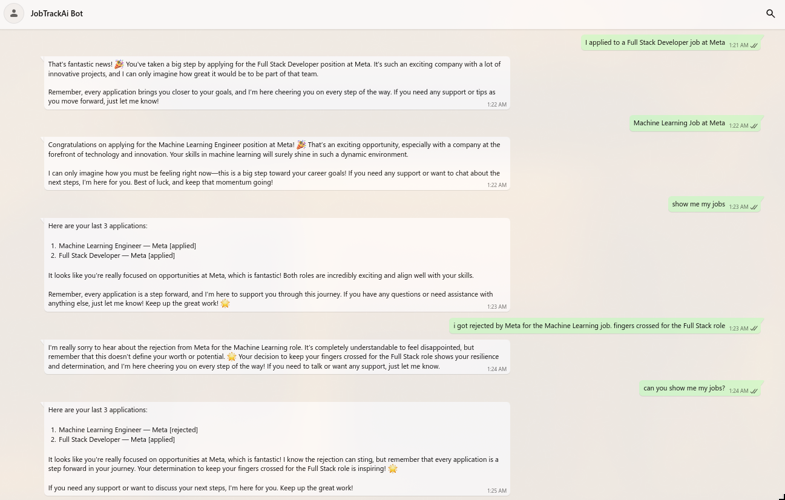

# JobTrackAI - Your Job Hunt Wingman 🎯

Ever lose track of where you applied? Yeah, me too. So I built this thing.



## What it does (the TLDR)

It's like having that one bro who never forgets where you applied and actually gives good advice. Drop a job link, update your status with "got rejected 😭", ask "show my jobs" - it just gets it.

**The good stuff:**
- Just paste job links and walk away (auto-grabs title/company)
- Talk to it like a human: "the Google one got back to me" 
- Doesn't ask stupid questions when it's obvious what you mean
- Your data lives in a real database, not some sketchy spreadsheet (yes you can query it)

**What makes it different:**
- Has emotional intelligence (comforts you after rejections, hypes you up for interviews)
- Understands context (no "which job?" when there's clearly only one)
- Refuses to do sketchy stuff politely
- Built by someone who also hates job hunting

## Quick Setup (5 minutes max)

**You'll need:**
- Python 3.11+
- OpenAI API key
- Supabase account (free tier works fine)

**Get it running:**
   ```bash
   git clone git@github.com:notquitethereyet/ai-job-agent.git
   cd ai-job-agent

# Install stuff
   curl -LsSf https://astral.sh/uv/install.sh | sh
   uv sync

# Set up your secrets
   cp .env.example .env
# Edit .env with your API keys

# Run it
   uv run uvicorn app.main:app --reload
   ```

Hit `http://localhost:8000/docs` and you're golden.

## How to actually use it

**Add a job:**
```bash
curl -X POST "http://localhost:8000/agent/message" \
     -H "Content-Type: application/json" \
  -d '{"message": "Applied to AI Engineer at OpenAI: https://jobs.lever.co/openai/whatever", "user_id": "your-uuid"}'
```

**Check your jobs:**
```bash
curl -X POST "http://localhost:8000/agent/message" \
     -H "Content-Type: application/json" \
  -d '{"message": "show my jobs", "user_id": "your-uuid"}'
```

**Update status:**
```bash
curl -X POST "http://localhost:8000/agent/message" \
     -H "Content-Type: application/json" \
  -d '{"message": "got rejected from the Meta job", "user_id": "your-uuid"}'
```

## Tech stuff (if you care)

- **FastAPI** - because it's fast and the docs are actually good
- **OpenAI GPT-4o-mini** - does the smart stuff (~~cheap~~ and cheerful)
- **Supabase** - PostgreSQL but without the pain
- **Python 3.11+** - obviously

## Database Schema (for future you)

The important tables:

**jobs** - where your applications live
- `job_title`, `company_name`, `status`, `job_link`, etc.
- Status can be: applied, interview, offer, rejected, withdrawn

**conversations** - keeps track of your chats
- Stores context so it remembers what you're talking about

Full schema is in `database/` if you want the details.

## Deploy it somewhere

**Railway (easiest):**
1. Connect your GitHub repo
2. Add your env vars (OPENAI_API_KEY, SUPABASE_URL, SUPABASE_ANON_KEY)
3. It just works™

**Docker:**
```bash
docker build -t jobtrackai .
docker run -p 8000:8000 --env-file .env jobtrackai
```

## If something breaks

Most likely causes:
- Missing environment variables (check your .env)
- Supabase isn't set up (run the SQL from database/schema.sql)
- Wrong Python version (needs 3.11+)

Health check is at `/health` - if that works, the problem is elsewhere.

## What's coming next

- WhatsApp/Discord integration (so you can complain about rejections in your group chat)
- Resume tailoring (make your CV actually match the job)
- Company research summaries (know what you're getting into)
- Better analytics (see your rejection rate and cry together)

## Contributing

Found a bug? Want a feature? PRs welcome. Just:
1. Fork it
2. Make it better
3. Send a PR

Don't overthink it.

## License

Licensed under the "Do whatever you want lil bro" License (DWYWLB-1.0)

---

**Why this exists:** Because job hunting sucks enough without losing track of where you applied. Built by someone who gets it.

**Built with:** FastAPI, OpenAI, Supabase, and way too much coffee ☕

For the technical deep-dive, check out [TECHNICAL_ARCHITECTURE.md](./TECHNICAL_ARCHITECTURE.md)